# ResQ System Architecture & Usage Flow

This document provides a visual and logical overview of the **ResQ Safety Alert System**. It is designed to help stakeholders understand how the different components (Frontend, Backend, Database) interact to provide real-time safety reporting and coordination.

## 1. High-Level Architecture
This diagram shows the "Big Picture" of how the system is organized.

```mermaid
graph TD
    %% Styling
    classDef user fill:#e1f5fe,stroke:#01579b,stroke-width:2px;
    classDef frontend fill:#fff3e0,stroke:#ff6f00,stroke-width:2px;
    classDef backend fill:#e8f5e9,stroke:#2e7d32,stroke-width:2px;
    classDef db fill:#f3e5f5,stroke:#7b1fa2,stroke-width:2px;
    classDef ext fill:#eceff1,stroke:#455a64,stroke-width:2px,stroke-dasharray: 5 5;

    %% Actors
    Reporter((👤 Reporter)):::user
    Admin((👮 Admin/Dispatcher)):::user

    %% Frontend
    subgraph Client_Workstation ["Frontend (React Application)"]
        Dash[💻 Dashboard & Map View]:::frontend
        Forms[📝 Report Forms]:::frontend
        SocketClient[🔌 WebSocket Client]:::frontend
    end

    %% Backend
    subgraph Server_Infrastructure ["Backend (Spring Boot Server)"]
        API[📡 REST API Controller]:::backend
        Auth[🔐 Security & Auth]:::backend
        Service[⚙️ Priority & Logic Service]:::backend
        SocketServer[📢 WebSocket Broadcaster]:::backend
    end

    %% Database
    subgraph Data_Layer ["Data Storage"]
        DB[(🗄️ PostgreSQL Database)]:::db
    end

    %% External
    Email[📧 Email Service]:::ext
    Maps[🌍 OpenStreetMap API]:::ext

    %% Interactions
    Reporter -->|1. Submits Incident| Forms
    Admin -->|2. Monitors Feed| Dash
    
    Forms -->|3. POST /accidents| API
    Dash -->|HTTPS / WSS| API
    
    API -->|Validates User| Auth
    API -->|Process Data| Service
    
    Service -->|Save Data| DB
    Service -->|4. Push Real-Time Alert| SocketServer
    
    SocketServer -->|5. Instant Update| SocketClient
    SocketClient -->|Update UI| Dash
    
    Service -->|Send Notifications| Email
    Dash -->|Fetch Location Data| Maps
```

---

## 2. Usage Workflow (The Life of a Report)
This flow chart explains exactly what happens step-by-step when an accident is reported.

```mermaid
sequenceDiagram
    autonumber
    actor Alice as 👤 Reporter (Alice)
    participant UI as 💻 Frontend App
    participant Server as ⚙️ Backend Server
    participant DB as 🗄️ Database
    actor Bob as 👮 Admin (Bob)

    Note over Alice, UI: Reporting Phase
    Alice->>UI: Fills Report via Form (Details + Image)
    UI->>UI: Auto-detects Location (Geolocation)
    UI->>Server: POST /accidents (Secure API Call)
    
    Note over Server, DB: Processing Phase
    Server->>Server: Calculate Severity Priority
    Server->>DB: Save Incident Record
    DB-->>Server: Confirm Save (ID: 101)
    
    Note over Server, Bob: Broadcasting Phase
    Server->>Bob: 📢 WEBSOCKET BROADCAST (New Alert!)
    Note right of Bob: Bob's screen updates instantly\nwithout refreshing.
    
    Note over Bob, DB: Resolution Phase
    Bob->>UI: Clicks "Resolve" on Dashboard
    UI->>Server: PATCH /accidents/101 (Status: RESOLVED)
    Server->>DB: Update Status
    Server->>Alice: 📧 Email Notification: "Your report is resolved."
```

## 3. Component Breakdown

| System | Technology | Purpose |
| :--- | :--- | :--- |
| **Frontend UI** | **React & Leaflet** | The visual interface used on laptops/phones. Handles mapping, forms, and displaying the "live board". |
| **Backend API** | **Java Spring Boot** | The "Brain". Handles security, calculates priority, and manages data flow. |
| **Database** | **PostgreSQL** | The "Memory". Stores users, reports, comments, and images permanently. |
| **Real-Time Engine** | **WebSockets (STOMP)** | The "Nervous System". Pushes updates instantly so Admins see accidents the second they happen. |
| **Security Layer** | **JWT (JSON Web Tokens)** | The "Keycard". Ensures only authorized users can post or delete data. |
